<p align="center">
  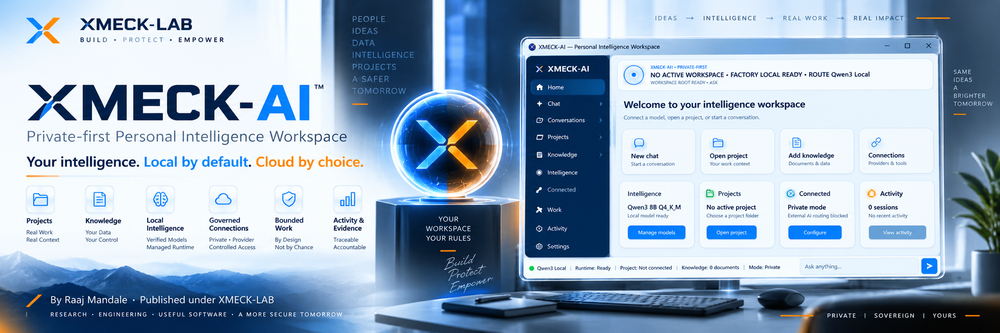
</p>

<h1 align="center">XMECK-AI</h1>

<p align="center">
  <strong>Private-first Personal Intelligence Workspace for Windows</strong><br>
  <strong>Your intelligence. Local by default. Cloud by choice.</strong>
</p>

<p align="center">
  Local intelligence · Projects/Git · Knowledge/RAG · Governed Work · Optional Connected Providers · Activity/Evidence · Recovery
</p>

<p align="center">
  <a href="#product-position">Product</a> ·
  <a href="#what-exists-today">Current Product</a> ·
  <a href="#managed-intelligence">Models</a> ·
  <a href="#architecture">Architecture</a> ·
  <a href="#engineering-evidence">Evidence</a> ·
  <a href="#market-position">Market Position</a> ·
  <a href="demo/index.html">Demo</a>
</p>

<p align="center">
  <a href="https://github.com/XMECK-LAB"><strong>XMECK-LAB</strong></a>
  &nbsp;·&nbsp;
  <a href="https://github.com/raajmandale"><strong>Raaj Mandale</strong></a>
</p>

---

## Product position

**XMECK-AI is not a model wrapper and not a cloud chatbot service.**

It is a single-user Windows intelligence workspace designed to combine:

- **local intelligence** without mandatory cloud credentials;
- **Projects** bound to user-owned local folders;
- **local Git inspection and governed change workflow**;
- **Knowledge/RAG** over user-controlled sources;
- **managed local model lifecycle** rather than filename trust;
- **explicit local/connected route selection** with no silent cloud fallback;
- **Ask / Research / Project / Build / Write** work modes;
- **bounded agents and tools** rather than ambient machine authority;
- **ProjectGuard** around protected egress and side effects;
- **Activity/Evidence** for visible readiness and actions;
- **recovery and deterministic lifecycle** as product concerns, not afterthoughts.

> **The user owns context, routing, authority, evidence and recovery. Models and providers are replaceable capabilities — not the product identity.**

## What exists today

The current installed product and the canonical engineering repository support the following public description.

<p align="center">
  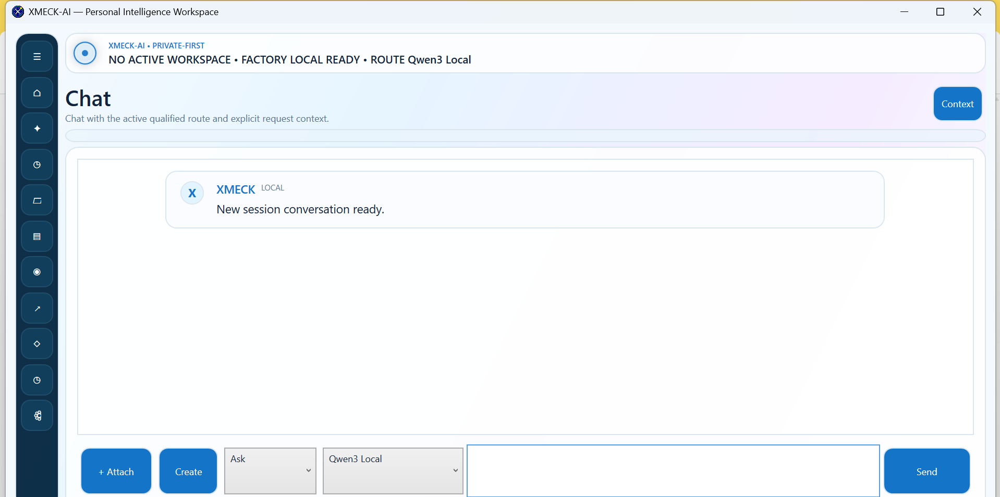
</p>

### Current customer surfaces

**Home / Command Center** · **Chat** · **Conversations** · **Projects** · **Knowledge** · **Intelligence** · **Connected** · **Work** · **Activity** · **Settings** · **Context/Evidence**

The current desktop application is **.NET 8 + WPF on Windows x64**.

### Local-first routing

The product has explicit operating/routing boundaries:

- **Private / local-first** operation;
- **Connected Private** when a provider is explicitly configured and qualified;
- **Cloud Assist / connected routes** only by explicit user choice;
- **no silent external fallback** when private/local routing is active.

<p align="center">
  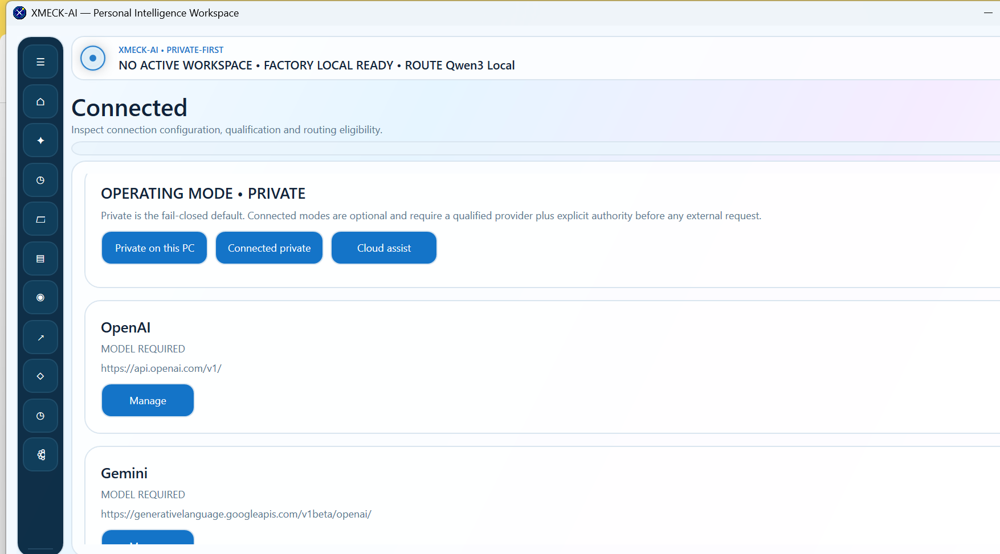
</p>

Connected-provider code and UI are real product surfaces, but **live credentials/account/provider admission remain evidence-bound**. Configuration is not automatically represented as qualification.

### Projects and Git

Projects remain user-owned local folders.

The current product surface includes:

- choose local project folder;
- inspect **Git status**;
- inspect **Git diff**;
- inspect **Git log**;
- index supported project text;
- propose a change;
- apply a reviewed change;
- undo an XMECK change.

Project access is **read-only by default**, with path escape/reparse traversal refused by design.

<p align="center">
  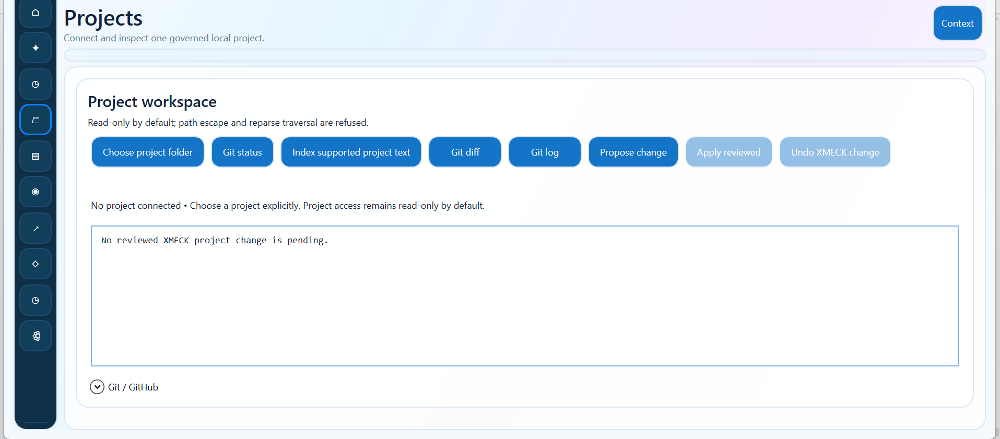
</p>

A live GitHub account/app integration is a separate boundary and should not be described as qualified until real account/repository proof exists.

## Managed intelligence

XMECK-AI does not treat “a model file exists” as the same thing as “the model is ready for work.”

<p align="center">
  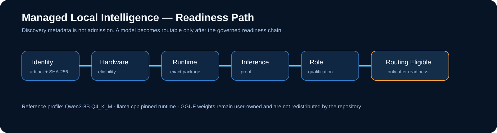
</p>

The governed readiness path is:

**identity → hardware eligibility → runtime load → inference proof → semantic-role qualification → routing eligibility**

The current reference local profile is:

| Component | Reference |
|---|---|
| Chat model | **Qwen3-8B Q4_K_M** |
| Local runtime | **llama.cpp** |
| Artifact format | **GGUF** |
| Chat model SHA-256 | `d98cdcbd03e17ce47681435b5150e34c1417f50b5c0019dd560e4882c5745785` |
| Embedding model | **Qwen3-Embedding-0.6B Q8_0** |
| Embedding SHA-256 | `06507c7b42688469c4e7298b0a1e16deff06caf291cf0a5b278c308249c3e439` |

Model weights are **user-owned resources** and are not redistributed by this public repository.

### Discovery is not admission

The current Intelligence surface can discover public GGUF metadata and expose candidate artifacts.

<p align="center">
  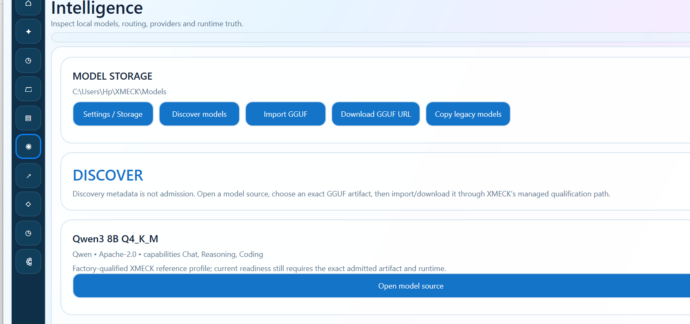
  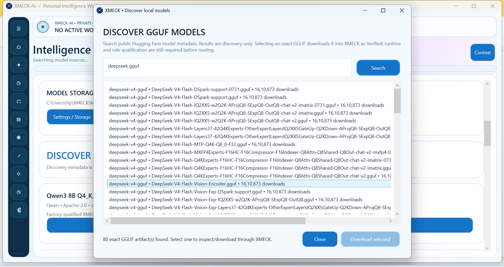
</p>

The public wording remains deliberately precise:

> **Discovery metadata is not admission.**

Selecting or finding a model does not make it routable. The exact artifact must still pass XMECK's integrity/runtime/role qualification path.

## Architecture

<p align="center">
  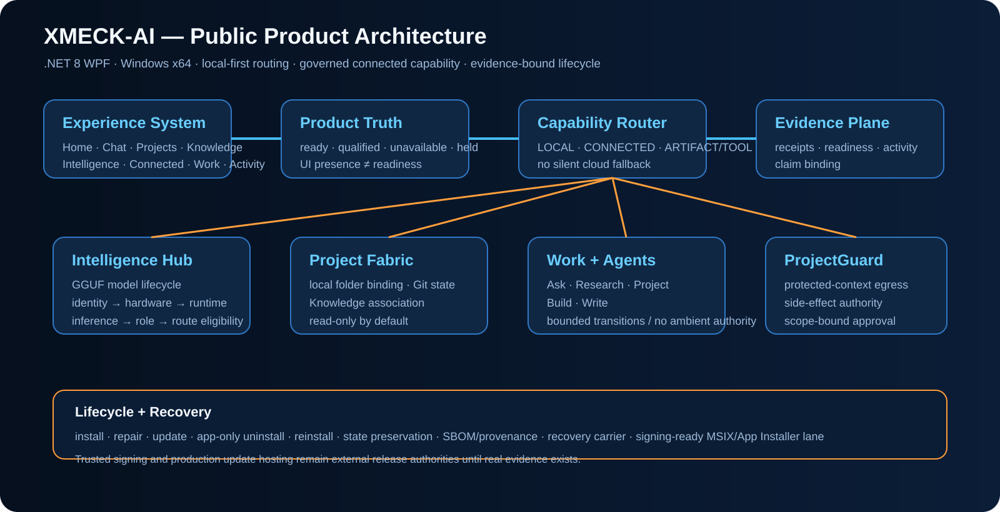
</p>

### Product Truth

XMECK distinguishes what is:

**ready** · **qualified** · **unavailable** · **held**

A button, screen or source file does not by itself establish readiness.

### Capability Router

Routes are explicit:

- **LOCAL**
- **CONNECTED**
- **local artifact/tool capability**

The architecture is intended to fail closed rather than silently send work to an external provider.

### ProjectGuard

ProjectGuard mediates protected-context egress and side-effect authority.

This is not presented as unrestricted autonomous computer control. Agent capability remains bounded by qualified subjects, scope and approval/evidence rules.

### Evidence plane

Readiness, important actions, lifecycle operations and release claims are designed to bind to observable evidence/receipts.

## Capability and claim boundary

<p align="center">
  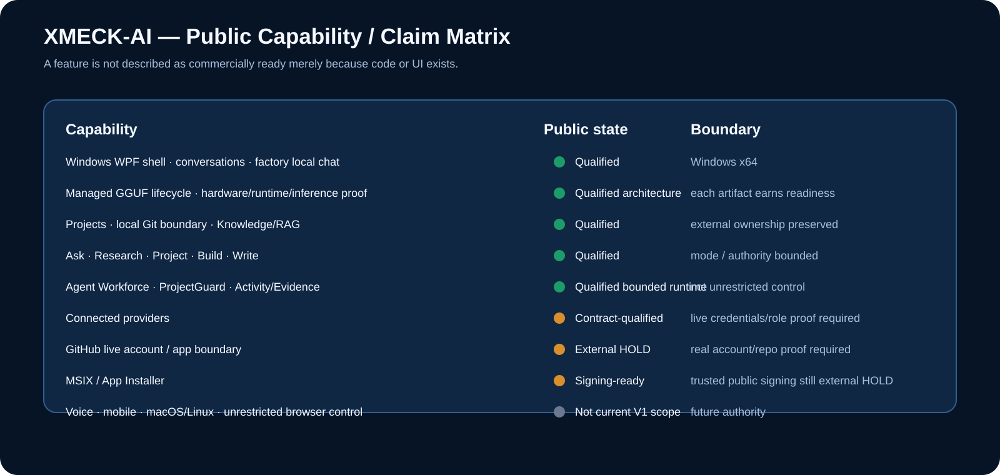
</p>

See [`docs/PUBLIC_CLAIMS_MATRIX.md`](docs/PUBLIC_CLAIMS_MATRIX.md) for the detailed boundary.

## Engineering evidence

The private engineering repository records terminal productization and Founder-machine evidence for the current Windows product lineage.

Publicly defensible statements include:

- a real **Windows x64 desktop application** exists;
- it has been physically installed and launched on the Founder machine;
- the current application identity is **XMECK-AI — Personal Intelligence Workspace**;
- local Qwen3 readiness has been observed;
- product/build/package/update/recovery lineage exists;
- local/private core and optional connected architecture are real;
- the canonical product baseline is **1.0.0.0**;
- a signing-ready MSIX/App Installer lane exists.

Important release boundary:

- the frozen Founder candidate is **not** equivalent to a trusted signed commercial public release;
- trusted Publisher/signing evidence remains external;
- a production update host remains external;
- a tested BAT wrapper had an install-boundary defect while direct embedded installer invocation succeeded;
- PMF, revenue, external security certification and performance leadership are **not proven**.

This boundary increases credibility; it does not reduce the engineering value.

## Current product screenshots

### Command Center / private-first state

<p align="center">
  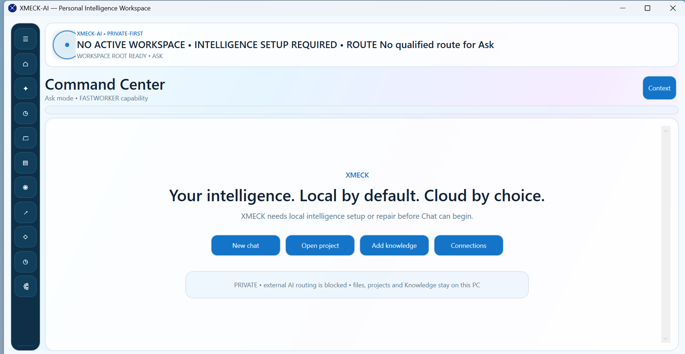
</p>

### Expanded product navigation

<p align="center">
  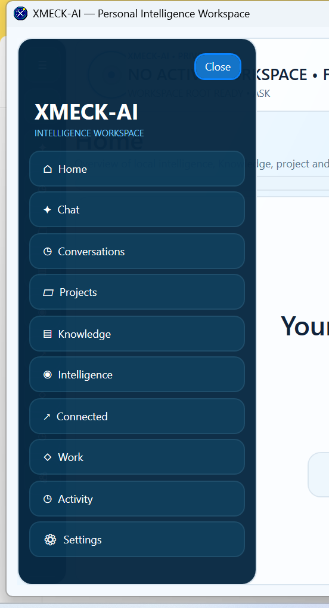
</p>

### Intelligence readiness

<p align="center">
  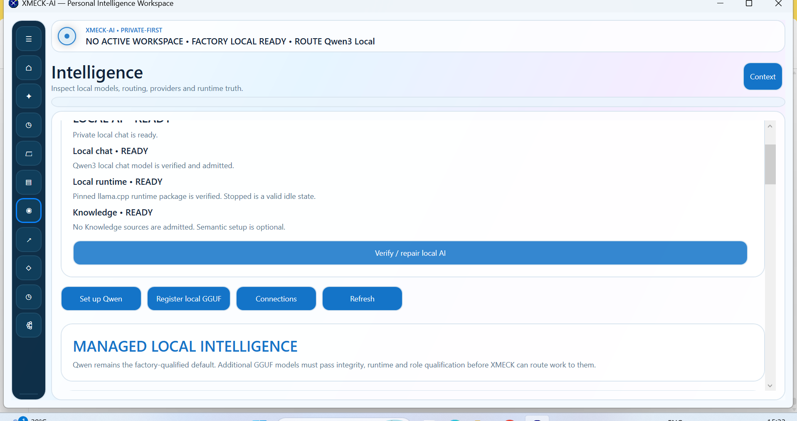
</p>

### Browser handoff surface

<p align="center">
  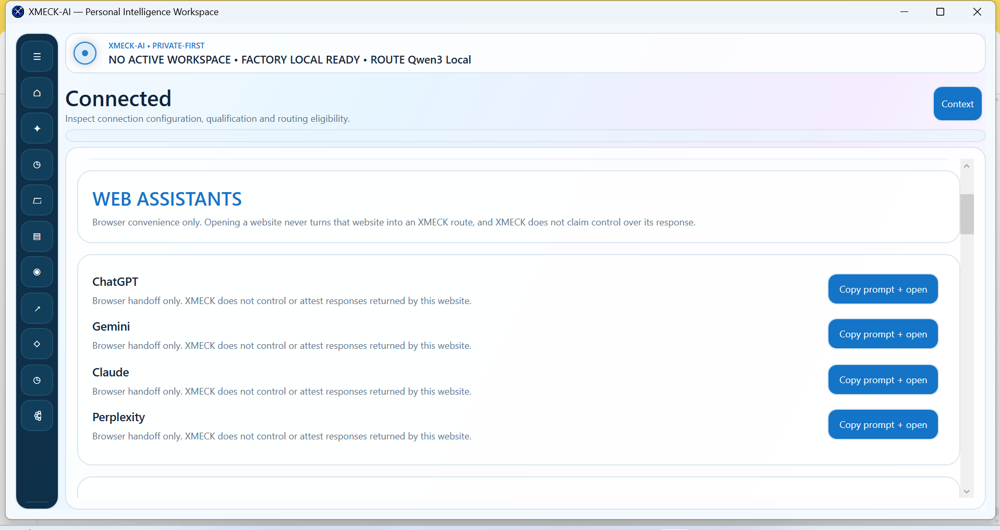
</p>

Browser convenience links do **not** turn third-party websites into qualified XMECK routes. The current UI explicitly preserves that distinction.

## Work and artifacts

The canonical V1 architecture includes work modes:

- **Ask**
- **Research**
- **Project**
- **Build**
- **Write**

Qualified artifact surfaces in the engineering lineage include:

- Markdown
- Report
- PDF
- DOCX
- PPTX
- Spreadsheet
- Code Package

An image route exists under a provider-qualification boundary.

Build mode separates **proposal** from **side-effect execution**.

## Market position

<p align="center">
  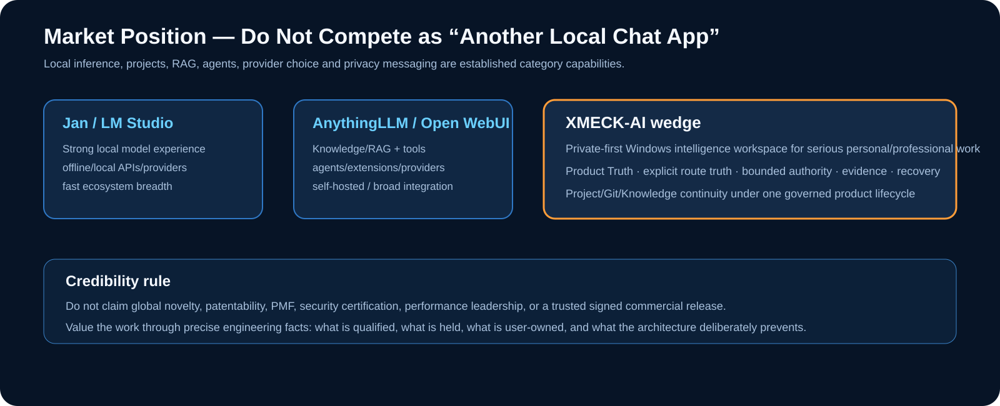
</p>

The desktop/local AI market already contains strong products for local inference, projects, RAG, agents, MCP/tools and connected providers.

XMECK-AI should therefore **not** claim those primitives alone as unique inventions.

Its strongest credible wedge is:

> **A governed private-first Windows intelligence workspace for serious personal/professional knowledge and engineering work where local control, explicit routing, bounded authority, evidence and recovery matter.**

See [`docs/MARKET_POSITIONING.md`](docs/MARKET_POSITIONING.md).

## What XMECK-AI is not

XMECK-AI is not currently presented as:

- a frontier foundation-model company;
- a cloud chatbot service;
- a multi-user enterprise collaboration server;
- a mobile product;
- a macOS/Linux qualified product;
- an unrestricted autonomous computer-control agent;
- a trusted signed public commercial release;
- a patent-proven globally novel technology;
- a compliance-certified security product.

Those boundaries keep the product story technically credible.

## Product lineage

```text
QBOX-AI R1
engineering foundation
        ↓
QBOX-AI R2
Founder-accepted local-intelligence milestone
        ↓
XMECK-AI
current product identity
```

R1/R2 should remain engineering provenance, not competing current products.

## XMECK-LAB ecosystem

```text
Raaj Mandale
creator / systems architect / research identity
        │
        └── XMECK-LAB
             ├── XRECONY
             │    └── data reconstruction / structural understanding
             ├── TRANSCRIPT
             │    └── governed execution
             │         └── KAVACH
             │              └── trust / protection substrate
             └── XMECK-AI
                  └── private-first personal intelligence workspace
```

### Identity separation

**Raaj Mandale** = creator / systems architect / independent research identity  
**XMECK-LAB** = public software/startup organization  
**XMECK-AI** = product

- Creator GitHub: https://github.com/raajmandale
- Creator website: https://raajmandale.in
- ORCID: https://orcid.org/0009-0005-9810-1655
- XMECK-LAB: https://github.com/XMECK-LAB

## Citation

Use [`CITATION.cff`](CITATION.cff) when referencing XMECK-AI in technical or research work.

## Public repository policy

The public repository should be a curated product surface.

Do **not** expose the private engineering repository wholesale.

Keep private:

- internal governance/freeze history;
- model weights;
- private evidence archives;
- secrets/API keys;
- unnecessary qualification machinery;
- protected implementation details that are not required to explain the product.

## Release status

**Current state: internally productized Founder/engineering candidate; trusted public release authorities still incomplete.**

The next public release gate should require:

1. trusted signing / Publisher identity;
2. public distribution path;
3. production update source;
4. final public installer lifecycle check;
5. current release asset + checksum + release notes.

---

<p align="center">
  <strong>Your intelligence. Local by default. Cloud by choice.</strong><br>
  Built by <a href="https://github.com/raajmandale">Raaj Mandale</a> · Published under <a href="https://github.com/XMECK-LAB">XMECK-LAB</a>
</p>
