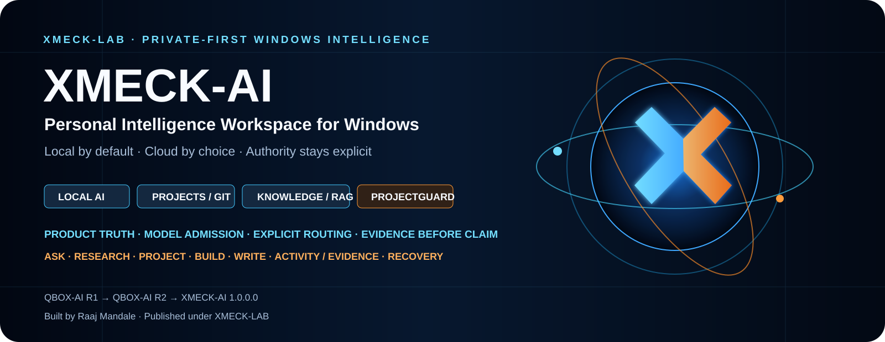
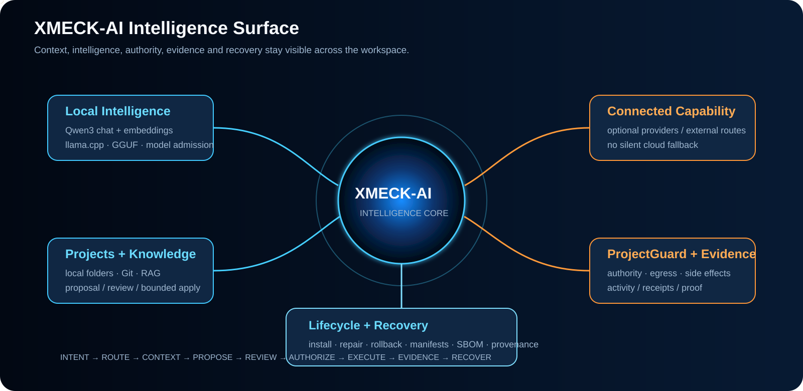
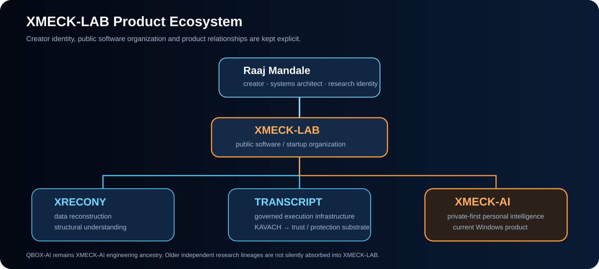

<p align="center">
  
</p>

<h1 align="center">🧠 XMECK-AI</h1>

<p align="center">
  <b>Private-first Personal Intelligence Workspace for Windows</b><br>
  Local Intelligence • Projects / Git • Knowledge / RAG • Governed Work • Evidence • Recovery
</p>

<div align="center">

[](https://github.com/XMECK-LAB/XMECK-AI)
[](docs/PRODUCT_FACTS.md)
[](XMECK_AI_1.0.0.0_PUBLIC_MANIFEST.json)
[](docs/RELEASE_BOUNDARY.md)
[](https://github.com/raajmandale)

<br>

[](https://raw.githubusercontent.com/XMECK-LAB/XMECK-AI/main/XMECK-AI_FINAL_FOUNDER_CANDIDATE_1.0.0.0.zip)
[](XMECK_AI_1.0.0.0_SHA256.txt)
[](DOWNLOAD_XMECK_AI_1.0.0.0.md)
[](docs/PUBLIC_EVIDENCE_INDEX.md)

</div>

<p align="center">
  <i>Your intelligence. Local by default. Cloud by choice.</i>
</p>

---

# 🌐 Product Intelligence Surface

<p align="center">
  
</p>

XMECK-AI is not built as another chat shell.

It is a Windows intelligence workspace designed to keep **context, routing, authority, evidence and recovery** visible across the product lifecycle.

> **The user owns context, routing, authority, evidence and recovery. Models and providers are replaceable capabilities — not the product identity.**

---

# ⚡ What XMECK-AI Brings Together

| Surface | Product role |
|---|---|
| 💬 **Chat / Conversations** | Local-first intelligence with durable conversation history |
| 📁 **Projects / Git** | User-owned folders, Git status/diff/log, bounded change workflow |
| 🧠 **Knowledge / RAG** | Grounded local knowledge and retrieval |
| ⚙️ **Intelligence** | Model discovery, identity, readiness and routing |
| 🌐 **Connected** | Optional providers and external-assistant routes |
| 🧭 **Work** | Ask / Research / Project / Build / Write modes |
| 🛡️ **ProjectGuard** | Protected-context egress and side-effect authority |
| 🧾 **Activity / Evidence** | Inspectable actions, receipts and proof |
| ♻️ **Recovery** | Lifecycle, manifests, SBOM, provenance and recovery carrier |

<p align="center">
  
</p>

<p align="center">
  
  
</p>

---

# 🚀 Download the Actual Builds

These are the **explicit runnable Windows ZIPs**. GitHub's automatic branch/tag source archive is not the runnable product artifact.

| Generation | Meaning | Direct build |
|---|---|---|
| 🧪 **QBOX-AI Stage B R1** | Engineering foundation | [⬇ Download R1 ZIP](https://raw.githubusercontent.com/XMECK-LAB/XMECK-AI/history/qbox-r1/QBOX-AI_STAGE-B_R1_HISTORICAL_WINDOWS-x64.zip) |
| 🧪 **QBOX-AI Stage B R2** | Founder-accepted local-intelligence milestone | [⬇ Download R2 ZIP](https://raw.githubusercontent.com/XMECK-LAB/XMECK-AI/history/qbox-r2/QBOX-AI_STAGE-B_R2_HISTORICAL_WINDOWS-x64.zip) |
| 🧠 **XMECK-AI 1.0.0.0** | Current product / engineering Founder candidate | [⬇ Download XMECK-AI ZIP](https://raw.githubusercontent.com/XMECK-LAB/XMECK-AI/main/XMECK-AI_FINAL_FOUNDER_CANDIDATE_1.0.0.0.zip) |

### 🔐 Exact SHA-256 identities

```text
R1
5188f023d8974c4132509b0a86f93659ca1ead5cb9915412569e730c733c11e4

R2
8e148b5751127fb76d62bf5b094618ab77d38931d0ff2e1836d86a1dae033da0

XMECK-AI 1.0.0.0
3cab42520c9ced37e25c0088f299d1cb3b896836c8abdfc364d3996aaf76b15c
```

Verify the current build on Windows:

```powershell
Get-FileHash ".\XMECK-AI_FINAL_FOUNDER_CANDIDATE_1.0.0.0.zip" -Algorithm SHA256
```

Full install / recovery / uninstall guide:
➡️ [`DOWNLOAD_XMECK_AI_1.0.0.0.md`](DOWNLOAD_XMECK_AI_1.0.0.0.md)

---

# 🧠 Reference Intelligence Stack

XMECK-AI separates **model discovery** from **model admission**.

A model appearing on disk or in metadata is not enough to make it route-ready.

## 💬 Chat reference

| Component | Reference |
|---|---|
| Model | **Qwen3-8B Q4_K_M** |
| Runtime family | **llama.cpp** |
| Format | **GGUF** |
| Chat artifact SHA-256 | `d98cdcbd03e17ce47681435b5150e34c1417f50b5c0019dd560e4882c5745785` |

## 🔎 Embedding reference

| Component | Reference |
|---|---|
| Model | **Qwen3-Embedding-0.6B Q8_0** |
| Role | Local embeddings / retrieval |
| Embedding artifact SHA-256 | `06507c7b42688469c4e7298b0a1e16deff06caf291cf0a5b278c308249c3e439` |

> Model weights are **not redistributed** by this repository. Users supply and own their model files.

### Model admission path

```text
DISCOVER
   ↓
IDENTITY
   ↓
HARDWARE ELIGIBILITY
   ↓
RUNTIME LOAD
   ↓
INFERENCE PROOF
   ↓
SEMANTIC ROLE QUALIFICATION
   ↓
ROUTING ELIGIBILITY
```

<p align="center">
  
</p>

---

# 🛡️ Authority Before Side Effects

XMECK-AI separates **capability** from **permission**.

```text
INTENT
  ↓
ROUTE
  ↓
CONTEXT
  ↓
PROPOSE
  ↓
REVIEW
  ↓
AUTHORIZE
  ↓
EXECUTE
  ↓
EVIDENCE
```

**ProjectGuard** is the boundary around protected context, external egress and side-effect authority.

A model being technically able to perform an action does not mean it automatically receives permission to do it.

---

# 🏛️ Product Architecture

<p align="center">
  
</p>

The public architecture connects:

- 🖥️ **Experience System**
- 🧾 **Product Truth**
- 🧠 **Intelligence Hub**
- 🧭 **Capability Router**
- 📁 **Project Fabric**
- 🛠️ **Work + bounded Agents**
- 🛡️ **ProjectGuard**
- 🔍 **Evidence Plane**
- ♻️ **Lifecycle + Recovery**

Detailed architecture:
➡️ [`docs/ARCHITECTURE.md`](docs/ARCHITECTURE.md)

---

# 🧬 Engineering Evolution

<p align="center">
  
</p>

```text
QBOX-AI Stage B R1
engineering foundation
        ↓
QBOX-AI Stage B R2
Founder-accepted working local-intelligence milestone
        ↓
XMECK-AI 1.0.0.0
current product identity
```

### 🧪 R1 — Engineering Foundation

- local-first Windows workspace foundation
- pinned runtime/model path
- chat and conversation foundations
- Projects and Knowledge foundations
- startup / validation tooling
- package and component manifests

### 🧪 R2 — Working Local-Intelligence Milestone

- stronger qualification plane
- exact model verification/admission
- local chat / streaming / cancellation evidence
- Projects/Git and Knowledge evidence
- stronger Windows acceptance discipline

### 🧠 XMECK-AI — Current Product

- private-first local intelligence
- Projects / Git
- Knowledge / RAG
- managed intelligence readiness
- explicit local / connected routing
- bounded Work modes
- ProjectGuard
- Activity / Evidence
- lifecycle / recovery / packaging

> R1 and R2 remain engineering provenance. **XMECK-AI is the current public product.**

---

# 🌌 XMECK-LAB Ecosystem

<p align="center">
  
</p>

| Identity / Product | Role |
|---|---|
| 👤 **Raaj Mandale** | Creator · systems architect · independent research identity |
| 🧩 **XMECK-LAB** | Public software / startup organization |
| 🧬 **XRECONY** | Data reconstruction / structural understanding |
| ⚙️ **TRANSCRIPT** | Governed execution infrastructure |
| 🛡️ **KAVACH** | Trust / protection substrate under TRANSCRIPT |
| 🧠 **XMECK-AI** | Private-first personal intelligence workspace |

### Identity law

- **Raaj Mandale** remains the creator / research identity.
- **XMECK-LAB** is the public software organization.
- **XMECK-AI** is the current intelligence product.
- **QBOX-AI** is preserved as XMECK-AI engineering ancestry, not a competing active product.
- Older independent research lineages are not silently absorbed into XMECK-LAB.

---

# 🖼️ Product Gallery

### 💬 Local intelligence

<p align="center">
  
</p>

### 📁 Projects / Git

<p align="center">
  
</p>

### 🌐 Explicit operating modes

<p align="center">
  
</p>

### ⚙️ Model discovery and readiness

<p align="center">
  
  
</p>

---

# 🧾 Product Truth / Evidence

XMECK-AI intentionally distinguishes:

```text
READY
QUALIFIED
UNAVAILABLE
HELD
```

UI presence alone does not prove readiness.

## ✅ Demonstrated / Qualified Engineering Scope

- real Windows x64 desktop product
- local Qwen3 reference path exercised
- Projects / Git / Knowledge / Intelligence / Connected / Work / Activity surfaces
- model identity and readiness architecture
- explicit local / connected route contract
- ProjectGuard and bounded Work modes
- deterministic package / recovery lineage
- SBOM / provenance / manifests
- signing-ready MSIX / App Installer engineering lane

## ⛔ Not Claimed

- trusted signed commercial release
- universal provider qualification
- independent security / compliance certification
- product-market fit / revenue / retention
- performance leadership
- model-quality leadership
- global novelty / patentability

➡️ [`docs/PUBLIC_CLAIMS_MATRIX.md`](docs/PUBLIC_CLAIMS_MATRIX.md)
➡️ [`docs/PUBLIC_EVIDENCE_INDEX.md`](docs/PUBLIC_EVIDENCE_INDEX.md)

---

# 🎯 Product Position

Local inference, RAG, projects, model/provider selection, agents and tool ecosystems are established capabilities in the current desktop/local-AI category.

XMECK-AI does **not** present those primitives alone as invention.

Its strongest product position is the operating discipline around them:

- 🧾 **Product Truth** instead of UI-only readiness
- 🧠 **Model admission** instead of trusting filenames
- 🧭 **Explicit routing** instead of silent fallback
- 🛡️ **ProjectGuard** instead of ambient authority
- 🔍 **Evidence-before-claim**
- 📁 **User-owned Projects / Knowledge / models**
- ♻️ **Recovery and lifecycle discipline**
- 📦 **Deterministic package / SBOM / provenance lineage**

➡️ [`docs/MARKET_POSITIONING.md`](docs/MARKET_POSITIONING.md)

---

# 📚 Documentation Surface

| Surface | Link |
|---|---|
| 🚀 Download / Verify / Install | [`DOWNLOAD_XMECK_AI_1.0.0.0.md`](DOWNLOAD_XMECK_AI_1.0.0.0.md) |
| 🏛️ Architecture | [`docs/ARCHITECTURE.md`](docs/ARCHITECTURE.md) |
| 🧠 Models + Routing | [`docs/MODELS_AND_ROUTING.md`](docs/MODELS_AND_ROUTING.md) |
| 🧾 Product Facts | [`docs/PRODUCT_FACTS.md`](docs/PRODUCT_FACTS.md) |
| 🔍 Claims Matrix | [`docs/PUBLIC_CLAIMS_MATRIX.md`](docs/PUBLIC_CLAIMS_MATRIX.md) |
| 🧬 Product Evolution | [`docs/PRODUCT_EVOLUTION.md`](docs/PRODUCT_EVOLUTION.md) |
| ♻️ Release Boundary | [`docs/RELEASE_BOUNDARY.md`](docs/RELEASE_BOUNDARY.md) |
| 🌌 Ecosystem | [`docs/ECOSYSTEM.md`](docs/ECOSYSTEM.md) |
| 🗺️ Repository Map | [`docs/REPOSITORY_MAP.md`](docs/REPOSITORY_MAP.md) |
| 🔬 Public Evidence | [`docs/PUBLIC_EVIDENCE_INDEX.md`](docs/PUBLIC_EVIDENCE_INDEX.md) |
| 🛡️ Security | [`SECURITY.md`](SECURITY.md) |
| 🧰 Support | [`SUPPORT.md`](SUPPORT.md) |

---

# 👤 Creator + Organization

## Raaj Mandale

Creator · Systems Architect · Research Identity

- GitHub: https://github.com/raajmandale
- Website: https://raajmandale.in

## XMECK-LAB

Public software / startup organization.

- GitHub: https://github.com/XMECK-LAB
- XMECK-AI: https://github.com/XMECK-LAB/XMECK-AI

---

# 📜 License + Release Boundary

This repository is publicly visible but **not automatically open source**.

- [`LICENSE.txt`](LICENSE.txt) — repository rights boundary
- [`BINARY_EVALUATION_LICENSE.txt`](BINARY_EVALUATION_LICENSE.txt) — evaluation permission for published binaries
- [`SECURITY.md`](SECURITY.md) — security reporting
- [`SUPPORT.md`](SUPPORT.md) — defect reporting / support guidance

### Current release state

**Internally productized engineering Founder candidate**

Still external:

- trusted Publisher / code signing
- production update host
- frictionless trusted public installer
- provider/account-specific live qualification where required

---

<div align="center">

[](https://raw.githubusercontent.com/XMECK-LAB/XMECK-AI/main/XMECK-AI_FINAL_FOUNDER_CANDIDATE_1.0.0.0.zip)
[](XMECK_AI_1.0.0.0_SHA256.txt)

<br><br>

<b>XMECK-AI</b><br>
Your intelligence. Local by default. Cloud by choice.<br>
Build → Test → Qualify → Evolve → Productize

<br><br>

Built by <a href="https://github.com/raajmandale"><b>Raaj Mandale</b></a>
&nbsp;·&nbsp;
Published under <a href="https://github.com/XMECK-LAB"><b>XMECK-LAB</b></a>

</div>
