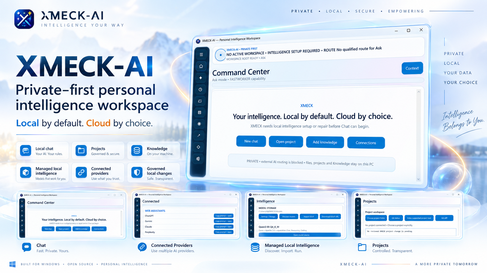
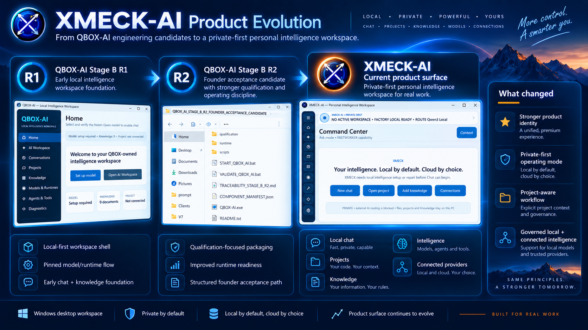
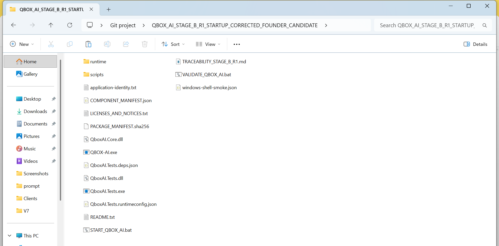
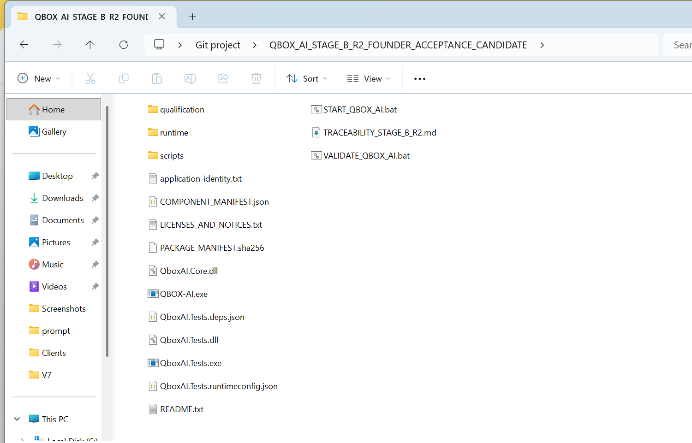
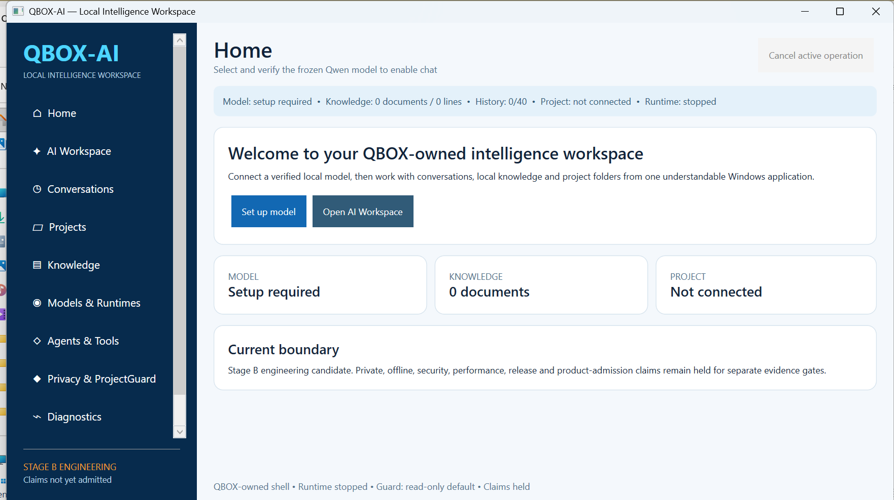
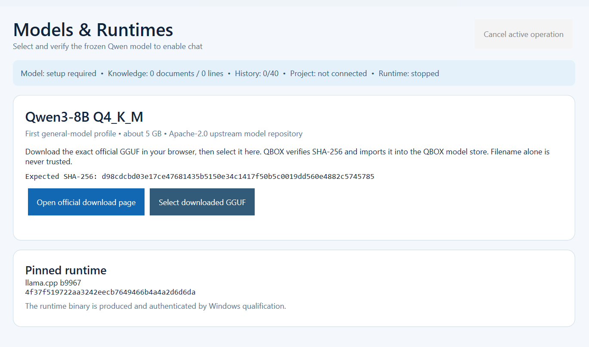
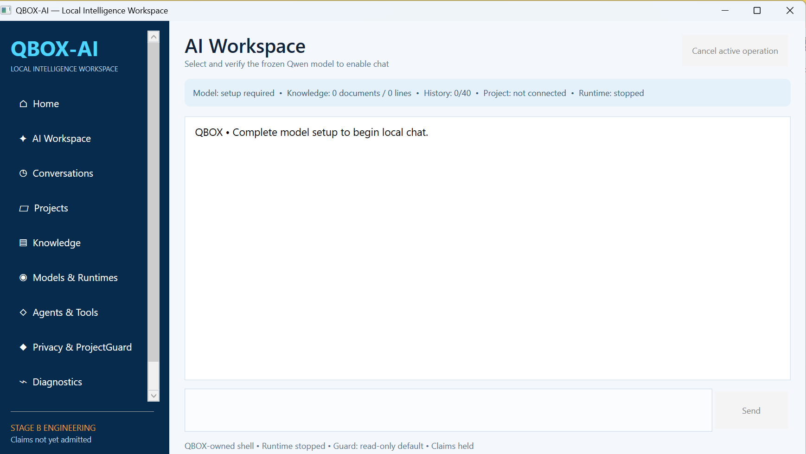

<p align="center">
  
</p>

<h1 align="center">XMECK-AI</h1>

<p align="center">
  <strong>Private-first Personal Intelligence Workspace for Windows</strong><br>
  <strong>Your intelligence. Local by default. Cloud by choice.</strong>
</p>

<p align="center">
  Local Intelligence · Projects/Git · Knowledge/RAG · Managed Models · Governed Connections · Work · Activity/Evidence · Recovery
</p>

<p align="center">
  <a href="#product-evolution">Evolution</a> ·
  <a href="#current-product">Current Product</a> ·
  <a href="#managed-intelligence">Models</a> ·
  <a href="#projects--git">Projects/Git</a> ·
  <a href="#architecture">Architecture</a> ·
  <a href="#engineering-boundary">Evidence</a> ·
  <a href="demo/index.html">Demo</a>
</p>

<p align="center">
  <a href="https://github.com/XMECK-LAB"><strong>XMECK-LAB</strong></a>
  &nbsp;·&nbsp;
  <a href="https://github.com/raajmandale"><strong>Raaj Mandale</strong></a>
</p>

---

## Product evolution

XMECK-AI has a traceable engineering lineage rather than a rewritten origin story.

<p align="center">
  
</p>

<p align="center">
  
</p>

### QBOX-AI Stage B R1 — engineering foundation

R1 established the early Windows/local-intelligence product foundation:

- QBOX-owned Windows workspace shell;
- explicit model setup;
- pinned model/runtime path;
- chat / conversations / Projects / Knowledge surfaces;
- package/component manifests and validation controls;
- startup-corrected Founder candidate lineage.

### QBOX-AI Stage B R2 — Founder-accepted working local-intelligence milestone

R2 superseded R1 for Founder functional acceptance and added a stronger qualification/packaging layer:

- `qualification/`, `runtime/`, `scripts/`;
- `TRACEABILITY_STAGE_B_R2.md`;
- exact-model admission workflow;
- pinned local runtime;
- real local chat path physically exercised;
- stronger readiness / acceptance discipline.

The preserved audit basis explicitly treats R1, R2 and XMECK-AI as **three generations/candidates — not three equal public releases**. fileciteturn136file0L5-L15

### XMECK-AI — current product identity

XMECK-AI is the successor product built from that validated foundation. The public lineage is intentionally simple:

```text
QBOX-AI R1
engineering foundation
        ↓
QBOX-AI R2
Founder-accepted working local-intelligence milestone
        ↓
XMECK-AI
current product
```

R1/R2 are **engineering provenance**. XMECK-AI is the current product users should discover today. The preserved audit reached the same conclusion after the Founder confirmed that model setup, Qwen admission and chat had already worked in the R1/R2 journey. fileciteturn136file0L382-L429

---

## Current product

<p align="center">
  
</p>

XMECK-AI is a **single-user Windows intelligence workspace** designed around a clear product law:

> **The user owns context, routing, authority, evidence and recovery. Models and providers are replaceable capabilities — not the product identity.**

<p align="center">
  
</p>

### Current surfaces

**Home / Command Center** · **Chat** · **Conversations** · **Projects** · **Knowledge** · **Intelligence** · **Connected** · **Work** · **Activity** · **Settings** · **Context/Evidence**

The current desktop product is built on **.NET 8 + WPF for Windows x64**.

### Product contract

- **private/local-first core** without mandatory cloud credentials;
- **external providers are optional** and never a silent fallback;
- **Projects remain user-owned local folders**;
- **models must earn readiness** rather than being trusted by filename;
- **agents/tools do not receive ambient authority**;
- **ProjectGuard** mediates protected egress and side effects;
- **Activity/Evidence** keeps important state and actions visible;
- **recovery/lifecycle** is part of the product architecture.

---

## Current product surface

### Local chat — factory route ready

<p align="center">
  
</p>

The current application can project a qualified local Qwen route and expose the active request context rather than treating the model as an invisible backend.

### Private-first operating modes

<p align="center">
  
</p>

The product distinguishes:

- **Private on this PC**
- **Connected private**
- **Cloud assist**

Connected capability remains explicit. A configured provider is not automatically represented as qualified.

---

## Projects + Git

<p align="center">
  
</p>

The current Projects surface includes:

- choose a local project folder;
- inspect **Git status**;
- inspect **Git diff**;
- inspect **Git log**;
- index supported project text;
- propose a change;
- apply a reviewed change;
- undo an XMECK change.

Project access is designed **read-only by default**, with side-effect execution separated from proposal/review.

A live GitHub account/app remains a separate qualification boundary.

---

## Managed intelligence

XMECK-AI deliberately separates **discovery**, **artifact identity**, **runtime readiness** and **routing eligibility**.

<p align="center">
  
</p>

The governed readiness path is:

**identity → hardware eligibility → runtime load → inference proof → semantic-role qualification → routing eligibility**

### Reference local profile

| Component | Current reference |
|---|---|
| Chat model | **Qwen3-8B Q4_K_M** |
| Local runtime | **llama.cpp** |
| Artifact format | **GGUF** |
| Chat SHA-256 | `d98cdcbd03e17ce47681435b5150e34c1417f50b5c0019dd560e4882c5745785` |
| Embedding model | **Qwen3-Embedding-0.6B Q8_0** |
| Embedding SHA-256 | `06507c7b42688469c4e7298b0a1e16deff06caf291cf0a5b278c308249c3e439` |

Model weights remain **user-owned resources** and are not redistributed by this public repository.

### Discovery is not admission

<p align="center">
  
  
</p>

The product can discover public GGUF metadata and present candidate artifacts.

That does **not** make a model ready.

> **Discovery metadata is not admission.**

---

## Engineering lineage gallery

These screens document the product ancestry. They are intentionally placed here rather than used as the current product hero.

### R1 — startup-corrected engineering candidate

<p align="center">
  
</p>

### R2 — Founder acceptance candidate

<p align="center">
  
</p>

<p align="center">
  
  
</p>

<p align="center">
  
</p>

The preserved engineering audit records the R1 package with `QBOX-AI.exe`, `QboxAI.Core.dll`, tests/runtime files, launch/validation scripts and package/component manifests, while R2 adds the qualification/runtime/scripts/traceability layer. fileciteturn136file0L18-L40

---

## Architecture

<p align="center">
  
</p>

XMECK-AI's architecture is intentionally broader than “local chat”:

```text
Experience System
      ↓
Product Truth
      ↓
Sovereign Storage ─ Intelligence Hub ─ Project Fabric
      ↓                    ↓                  ↓
Managed Model Lifecycle  Capability Router   Project/Git
                         ↙            ↘
                      LOCAL        CONNECTED
                         ↓            ↓
                      Knowledge    Providers/Web
                         ↓
          Ask / Research / Project / Build / Write
                         ↓
                   Agent Workforce
                         ↓
                    ProjectGuard
                         ↓
                      Evidence
                         ↓
                 Artifacts / Output
                         ↓
                Diagnostics/Recovery
                         ↓
           Lifecycle / Packaging / Update
```

### Product Truth

UI presence alone does not establish readiness.

XMECK distinguishes:

**ready** · **qualified** · **unavailable** · **held**

### Routing truth

Routes remain explicit:

- **LOCAL**
- **CONNECTED**
- **local artifact/tool capability**

Private/local operation is designed to avoid silent cloud fallback.

### Authority

Agent capability does not equal unrestricted machine authority.

ProjectGuard mediates protected-context egress and side-effect authority.

---

## Work modes + artifacts

The current architecture includes:

**Ask** · **Research** · **Project** · **Build** · **Write**

Build mode separates proposal from side-effect execution.

Qualified artifact surfaces in the engineering lineage include:

- Markdown
- Report
- PDF
- DOCX
- PPTX
- Spreadsheet
- Code Package

Image generation remains route/provider-bound rather than being implied as universally available.

---

## Market position

The local-AI desktop market already includes mature products for local inference, projects, RAG, model/provider choice, agents and tools.

XMECK-AI should therefore **not** market commodity primitives as invention.

Its strongest credible position is:

> **A governed private-first Windows intelligence workspace for serious personal/professional knowledge and engineering work where local control, explicit routing, bounded authority, evidence and recovery matter.**

The preserved product audit likewise concluded that the differentiated value is the integrated architecture rather than any single local-AI primitive. fileciteturn136file0L447-L551

See [`docs/MARKET_POSITIONING.md`](docs/MARKET_POSITIONING.md).

---

## Engineering boundary

<p align="center">
  
</p>

Current defensible public statements include:

- a real Windows x64 desktop product exists;
- the application has been installed/launched on the Founder machine;
- local Qwen3 readiness has been observed;
- Projects/Git/Knowledge/Intelligence/Connected/Work/Activity surfaces exist;
- managed model identity/readiness architecture exists;
- deterministic package/recovery/update lineage exists;
- a signing-ready MSIX/App Installer lane exists.

Not established by the current public evidence:

- trusted signed commercial release;
- universal provider qualification;
- independent security/compliance certification;
- PMF/revenue/retention;
- performance/model-quality leadership;
- global novelty/patentability.

Credibility comes from **saying exactly what exists and exactly what remains held**.

---

## Historical milestone policy

The public repository preserves R1/R2 as **engineering milestones**.

It does **not** ask users to choose among three active products.

```text
HISTORY
  QBOX-AI R1 — engineering foundation
  QBOX-AI R2 — Founder-accepted local intelligence milestone

CURRENT PRODUCT
  XMECK-AI — current Windows intelligence workspace
```

The preserved public-strategy audit explicitly recommended this structure instead of “Release 1 = R1 / Release 2 = R2 / Release 3 = XMECK-AI.” fileciteturn136file0L795-L841

Detailed milestone notes:
- [`releases/QBOX_R1_ENGINEERING_MILESTONE.md`](releases/QBOX_R1_ENGINEERING_MILESTONE.md)
- [`releases/QBOX_R2_FOUNDER_ACCEPTANCE_MILESTONE.md`](releases/QBOX_R2_FOUNDER_ACCEPTANCE_MILESTONE.md)
- [`releases/XMECK_AI_CURRENT_PRODUCT.md`](releases/XMECK_AI_CURRENT_PRODUCT.md)

---

## Demo

Open [`demo/index.html`](demo/index.html) for a motion-first product presentation surface.

The demo is a **visual/product explanation layer**, not a substitute for executable qualification evidence.

---

## XMECK-LAB + creator identity

```text
Raaj Mandale
creator / systems architect / research identity
        │
        └── XMECK-LAB
             ├── XRECONY
             ├── TRANSCRIPT
             │    └── KAVACH
             └── XMECK-AI
```

- Creator: https://github.com/raajmandale
- Website: https://raajmandale.in
- ORCID: https://orcid.org/0009-0005-9810-1655
- XMECK-LAB: https://github.com/XMECK-LAB
- XMECK-AI: https://github.com/XMECK-LAB/XMECK-AI

---

## Citation

Use [`CITATION.cff`](CITATION.cff) when referencing XMECK-AI in technical or research work.

---

## Release status

**Current state: internally productized Founder/engineering candidate; trusted public release authorities remain incomplete.**

A trusted downloadable public release should require:

1. final public installer/package;
2. SHA-256 checksum;
3. trusted Publisher/signing evidence;
4. public distribution/update authority;
5. release notes and explicit capability boundary;
6. final lifecycle proof for the public distribution path.

---

<p align="center">
  <strong>Your intelligence. Local by default. Cloud by choice.</strong><br>
  Built by <a href="https://github.com/raajmandale">Raaj Mandale</a> · Published under <a href="https://github.com/XMECK-LAB">XMECK-LAB</a>
</p>

