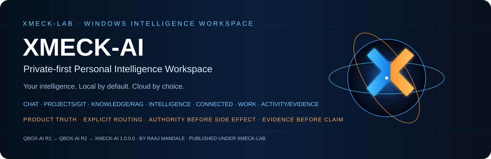
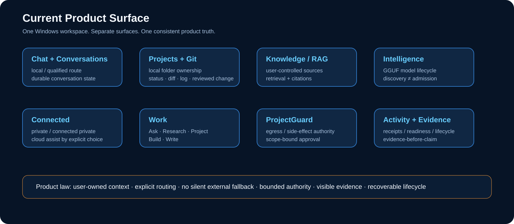
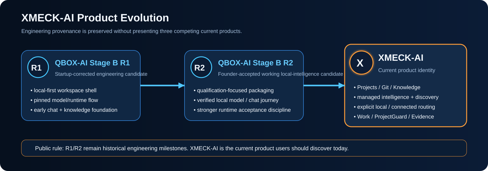

<p align="center">
  
</p>

<h1 align="center">XMECK-AI</h1>

<p align="center">
  <strong>Private-first personal intelligence for Windows.</strong><br>
  Local by default. Cloud by choice. Authority stays explicit.
</p>

<p align="center">
  <a href="XMECK-AI_FINAL_FOUNDER_CANDIDATE_1.0.0.0.zip"><strong>Download 1.0.0.0</strong></a>
  &nbsp;·&nbsp;
  <a href="DOWNLOAD_XMECK_AI_1.0.0.0.md"><strong>Verify & Install</strong></a>
  &nbsp;·&nbsp;
  <a href="docs/ARCHITECTURE.md"><strong>Architecture</strong></a>
  &nbsp;·&nbsp;
  <a href="docs/PUBLIC_EVIDENCE_INDEX.md"><strong>Evidence</strong></a>
</p>

<p align="center">
  <strong>Windows x64</strong>
  &nbsp;·&nbsp;
  <strong>.NET 8 / WPF</strong>
  &nbsp;·&nbsp;
  <strong>Local + optional connected routes</strong>
  &nbsp;·&nbsp;
  <strong>Engineering Founder Candidate</strong>
</p>

<p align="center">
  Built by <a href="https://github.com/raajmandale"><strong>Raaj Mandale</strong>
  </a> · Published under <a href="https://github.com/XMECK-LAB"><strong>XMECK-LAB</strong></a>
</p>

---

## Intelligence that remains under your control

XMECK-AI is a Windows intelligence workspace built around a simple product law:

> **The user owns context, routing, authority, evidence, and recovery. Models and providers are replaceable capabilities — not the product identity.**

It brings local intelligence, Projects/Git, Knowledge/RAG, managed models, optional connected providers, bounded work modes, ProjectGuard, Activity/Evidence, and recovery into one desktop product.

<table>
<tr>
<td width="25%"><strong>Private-first</strong><br><br>Core local use does not require a cloud account. External providers are optional and never treated as silent fallback.</td>
<td width="25%"><strong>Governed work</strong><br><br>ProjectGuard separates capability from permission around protected context, egress, and side effects.</td>
<td width="25%"><strong>Product truth</strong><br><br>Ready, qualified, unavailable, and held are distinct states. UI presence alone is not proof.</td>
<td width="25%"><strong>Recoverable</strong><br><br>Lifecycle, manifests, provenance, SBOM, evidence, and recovery are part of the product architecture.</td>
</tr>
</table>

---

## See the product

<p align="center">
  
</p>

<p align="center">
  
  
</p>

<p align="center">
  
  
</p>

### Product surfaces

| Surface | Purpose |
|---|---|
| **Home / Command Center** | Product state, readiness, active route |
| **Chat / Conversations** | Local-first intelligence and durable history |
| **Projects** | User-owned local workspaces with Git-aware workflows |
| **Knowledge** | Local grounded knowledge / RAG |
| **Intelligence** | Model discovery, identity, readiness and routing |
| **Connected** | Optional provider and external-assistant paths |
| **Work** | Governed Ask / Research / Project / Build / Write modes |
| **Activity / Evidence** | Visible action and evidence history |
| **Context / Evidence** | Inspectable request context and proof surface |
| **Settings** | Runtime, storage and product configuration |

---

## Download XMECK-AI 1.0.0.0

**Current public engineering candidate**

[`XMECK-AI_FINAL_FOUNDER_CANDIDATE_1.0.0.0.zip`](XMECK-AI_FINAL_FOUNDER_CANDIDATE_1.0.0.0.zip)

SHA-256:

```text
0b3c346e2b9df7d8ee121f3451db0ef98ee340096a26b8f4a313cdbca44e1dd3
```

Verify on Windows:

```powershell
Get-FileHash ".\XMECK-AI_FINAL_FOUNDER_CANDIDATE_1.0.0.0.zip" -Algorithm SHA256
```

Then extract the ZIP and read [`DOWNLOAD_XMECK_AI_1.0.0.0.md`](DOWNLOAD_XMECK_AI_1.0.0.0.md) before installing.

> **Release boundary:** this is the exact frozen engineering Founder candidate. It is not represented as a trusted code-signed commercial installer. Trusted signing and production update hosting remain external release holds.

---

## The operating model

<p align="center">
  
</p>

XMECK-AI is designed around explicit state and authority rather than ambient automation.

```text
User intent
    |
    v
Product Truth
    |
    +--> Local intelligence
    |
    +--> Connected capability
    |
    +--> Projects / Git / Knowledge
              |
              v
       Ask / Research / Project / Build / Write
              |
              v
         ProjectGuard
              |
     propose -> review -> authorize
              |
              v
           execute
              |
              v
           evidence
              |
              v
     artifacts / recovery
```

### ProjectGuard

A model being technically capable of an operation does not automatically authorize it.

The intended product flow is:

```text
propose
  -> review
  -> authorize
  -> execute
  -> record evidence
```

not:

```text
model can do it
  -> therefore model may do it
```

---

## Managed local intelligence

The current reference local profile is:

| Component | Reference |
|---|---|
| **Chat model** | Qwen3-8B Q4_K_M |
| **Embedding model** | Qwen3-Embedding-0.6B Q8_0 |
| **Runtime family** | llama.cpp |
| **Artifact format** | GGUF |
| **Chat SHA-256** | `d98cdcbd03e17ce47681435b5150e34c1417f50b5c0019dd560e4882c5745785` |
| **Embedding SHA-256** | `06507c7b42688469c4e7298b0a1e16deff06caf291cf0a5b278c308249c3e439` |

Model weights are **not redistributed** by this repository.

### Readiness is earned

<p align="center">
  
</p>

```text
identity
  -> hardware eligibility
  -> runtime load
  -> inference proof
  -> semantic-role qualification
  -> routing eligibility
```

> **Discovery metadata is not admission.**

---

## Projects, Git and Knowledge

<p align="center">
  
</p>

The project workflow is designed around user-owned local folders:

- inspect Git status, diff and log;
- index supported project text;
- associate local Knowledge;
- propose a change;
- review before applying;
- apply a reviewed change;
- undo an XMECK-applied change.

Project access is designed **read-only by default**, with side-effect execution separated from proposal and review.

Knowledge/RAG is part of the same local-first operating model rather than a separate cloud dependency.

---

## Local by default. Connected by explicit choice.

<p align="center">
  
</p>

XMECK-AI distinguishes:

- **Private on this PC**
- **Connected private**
- **Cloud assist**

External providers are optional. A configured provider is not automatically represented as qualified, and private/local operation is not silently upgraded to an external route.

---

## Architecture

<p align="center">
  
</p>

```text
Experience System
      |
Product Truth
      |
+--------------------+----------------------+-------------------+
| Sovereign Storage  | Intelligence Hub     | Project Fabric    |
|                    |                      |                   |
|                    +-> Managed Models     +-> Projects / Git  |
|                    +-> Capability Router  +-> Knowledge       |
|                           |                                    |
|                      +----+----+                               |
|                      |         |                               |
|                    LOCAL    CONNECTED                           |
+----------------------+---------+-------------------------------+
                       |
         Ask / Research / Project / Build / Write
                       |
                Agent Workforce
                       |
                  ProjectGuard
                       |
                    Evidence
                       |
               Artifacts / Output
                       |
             Diagnostics / Recovery
                       |
          Lifecycle / Packaging / Update
```

Read the detailed public architecture: [`docs/ARCHITECTURE.md`](docs/ARCHITECTURE.md)

---

## Product truth and evidence

<p align="center">
  
</p>

### Demonstrated / qualified engineering scope

- Windows x64 desktop product;
- local Qwen3 reference path exercised;
- Projects / Git / Knowledge / Intelligence / Connected / Work / Activity surfaces;
- model identity and readiness architecture;
- local / connected routing contract;
- ProjectGuard and bounded work modes;
- deterministic package / recovery lineage;
- SBOM / provenance / manifests;
- signing-ready MSIX / App Installer engineering lane.

### Not established by this repository

- trusted signed commercial release;
- universal provider qualification;
- independent security or compliance certification;
- product-market fit, revenue, or retention;
- performance or model-quality leadership;
- global novelty or patentability.

> **Evidence before claim.**

Full matrix: [`docs/PUBLIC_CLAIMS_MATRIX.md`](docs/PUBLIC_CLAIMS_MATRIX.md)

---

## Engineering lineage

XMECK-AI preserves the engineering generations that led to the current product.

<p align="center">
  
</p>

| Generation | Public state | Runnable artifact |
|---|---|---|
| **QBOX-AI Stage B R1** | [`history/qbox-r1`](https://github.com/XMECK-LAB/XMECK-AI/tree/history/qbox-r1) | `QBOX-AI_STAGE-B_R1_HISTORICAL_WINDOWS-x64.zip` |
| **QBOX-AI Stage B R2** | [`history/qbox-r2`](https://github.com/XMECK-LAB/XMECK-AI/tree/history/qbox-r2) | `QBOX-AI_STAGE-B_R2_HISTORICAL_WINDOWS-x64.zip` |
| **XMECK-AI 1.0.0.0** | `main` | `XMECK-AI_FINAL_FOUNDER_CANDIDATE_1.0.0.0.zip` |

### R1 — engineering foundation

R1 preserves the early Windows/local-intelligence foundation, startup/validation tooling, package manifests and first coherent model/runtime path.

### R2 — working local-intelligence milestone

R2 adds stronger qualification, exact model admission, runtime provenance, conversation lifecycle evidence, Projects/Git and Knowledge evidence, and sustained Windows journey validation.

### XMECK-AI — current product

The current product converges that engineering lineage into the private-first workspace described above.

Historical builds remain provenance, not competing current products.

---

## Why this product exists

By 2026, local inference, document RAG, projects, provider choice, model switching and agent/tool ecosystems are established category capabilities.

XMECK-AI does not treat those primitives alone as differentiation.

Its product thesis is the **operating discipline around them**:

1. **Product Truth** rather than UI-only readiness
2. **Model admission** rather than filename trust
3. **Explicit routing** rather than silent fallback
4. **ProjectGuard** rather than ambient authority
5. **Evidence-before-claim**
6. **User-owned Projects, Knowledge and models**
7. **Recovery and lifecycle discipline**
8. **Deterministic package, SBOM and provenance lineage**

See [`docs/MARKET_POSITIONING.md`](docs/MARKET_POSITIONING.md) for the current category comparison and references.

---

## Documentation

| Area | Document |
|---|---|
| Architecture | [`docs/ARCHITECTURE.md`](docs/ARCHITECTURE.md) |
| Product facts | [`docs/PRODUCT_FACTS.md`](docs/PRODUCT_FACTS.md) |
| Claims | [`docs/PUBLIC_CLAIMS_MATRIX.md`](docs/PUBLIC_CLAIMS_MATRIX.md) |
| Market position | [`docs/MARKET_POSITIONING.md`](docs/MARKET_POSITIONING.md) |
| Models / routing | [`docs/MODELS_AND_ROUTING.md`](docs/MODELS_AND_ROUTING.md) |
| Product evolution | [`docs/PRODUCT_EVOLUTION.md`](docs/PRODUCT_EVOLUTION.md) |
| Release boundary | [`docs/RELEASE_BOUNDARY.md`](docs/RELEASE_BOUNDARY.md) |
| Repository map | [`docs/REPOSITORY_MAP.md`](docs/REPOSITORY_MAP.md) |
| Public evidence | [`docs/PUBLIC_EVIDENCE_INDEX.md`](docs/PUBLIC_EVIDENCE_INDEX.md) |
| Engineering provenance | [`docs/ENGINEERING_PROVENANCE.md`](docs/ENGINEERING_PROVENANCE.md) |
| Ecosystem | [`docs/ECOSYSTEM.md`](docs/ECOSYSTEM.md) |
| Lineage | [`docs/LINEAGE.md`](docs/LINEAGE.md) |

---

## XMECK-LAB

```text
Raaj Mandale
creator / systems architect / research identity
        |
        +-- XMECK-LAB
             |
             +-- XRECONY
             |    reconstruction / structural understanding
             |
             +-- TRANSCRIPT
             |    governed execution infrastructure
             |       |
             |       +-- KAVACH
             |            trust / protection substrate
             |
             +-- XMECK-AI
                  private-first personal intelligence workspace
```

- **Creator:** [Raaj Mandale](https://github.com/raajmandale)
- **XMECK-LAB:** [github.com/XMECK-LAB](https://github.com/XMECK-LAB)
- **Product:** [XMECK-AI](https://github.com/XMECK-LAB/XMECK-AI)

---

## License, evaluation and security

This repository is publicly visible but **not automatically open source**.

- [`LICENSE.txt`](LICENSE.txt) — repository rights boundary
- [`BINARY_EVALUATION_LICENSE.txt`](BINARY_EVALUATION_LICENSE.txt) — permission for published binary evaluation
- [`SECURITY.md`](SECURITY.md) — security reporting guidance
- [`SUPPORT.md`](SUPPORT.md) — support and defect-reporting guidance

Third-party components remain subject to their own licenses and notices.

---

## Current release boundary

**XMECK-AI 1.0.0.0 is an internally productized engineering Founder candidate.**

Still external:

- trusted Publisher / code-signing identity;
- production update host;
- frictionless trusted public installer;
- provider/account-specific live proof where required.

Future capability or release claims must earn their own evidence.

---

<p align="center">
  <strong>Your intelligence. Local by default. Cloud by choice.</strong><br>
  <sub>Build → Test → Qualify → Evolve → Productize</sub><br><br>
  Built by <a href="https://github.com/raajmandale"><strong>Raaj Mandale</strong></a>
  ·
  Published under <a href="https://github.com/XMECK-LAB"><strong>XMECK-LAB</strong></a>
</p>
